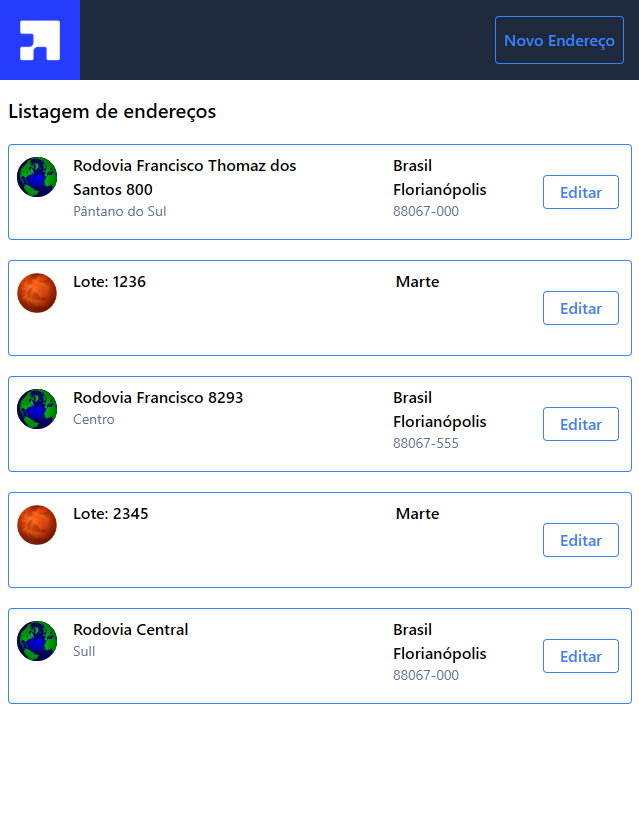
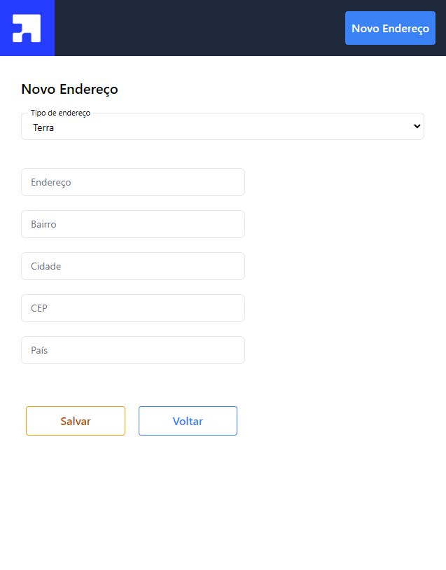
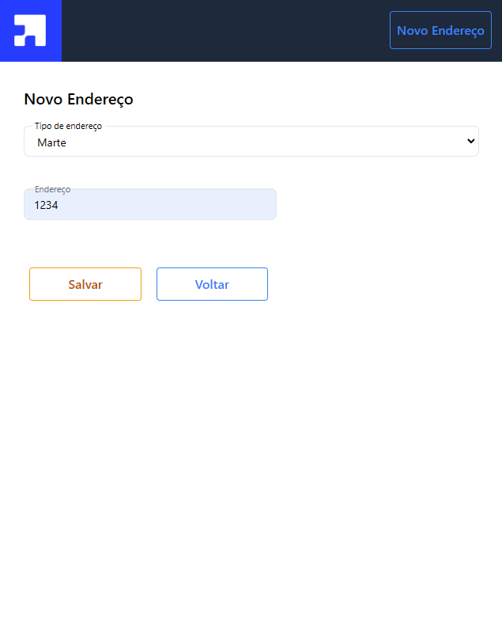
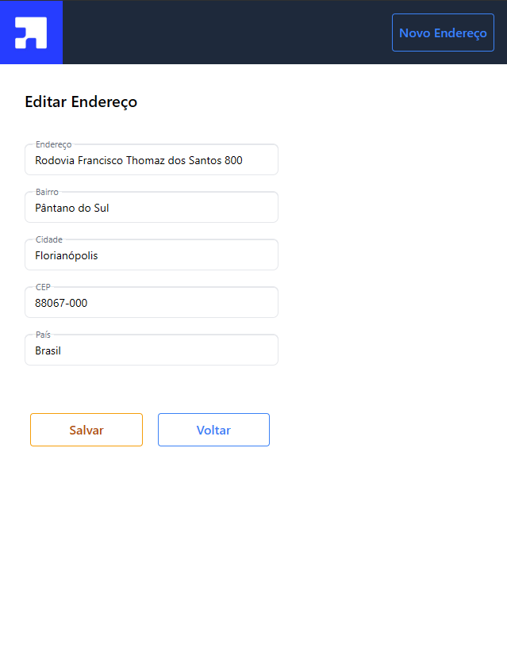
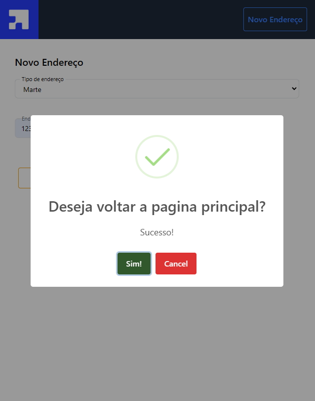
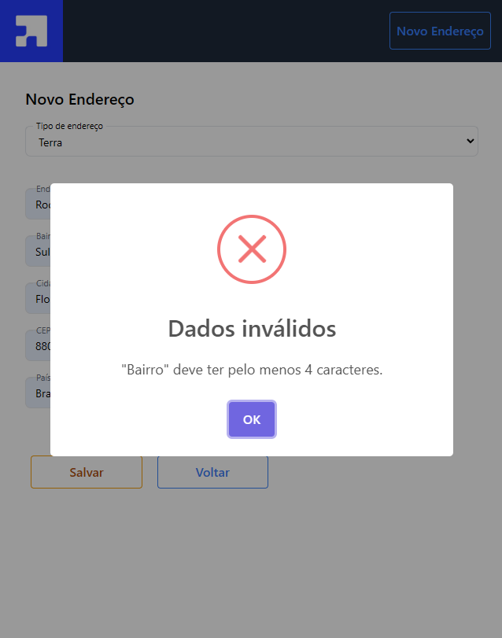

## Descrição:

Este aplicativo foi desenvolvido para permitir aos usuários visualizar uma lista de endereços, assim como criar um novo registro de endereço e editar um registro existente.

Tecnologias Utilizadas:
- Typescript;
- React com create-react-app;
- Tailwind com responsividade para telas a partir de 480;
- Joi para validação dos inputs;
- SweetAlert para alertas;
- UuidV4 para geração de ids;

Visite o site no link abaixo:

https://address-management3.vercel.app/

## Funcionalidades principais:

- Visualizar a lista de endereços cadastrados:

- Cadastrar um novo endereço:

- Editar um endereço já existente:

- Exemplos dos alertas:

## Como Executar o Projeto:
  
  1. Execute o comando a seguir no diretório raiz:
       
         npm install

  2. Execute o comando:

         npm start

  3. Acesse o aplicativo:

         http://localhost:3000/